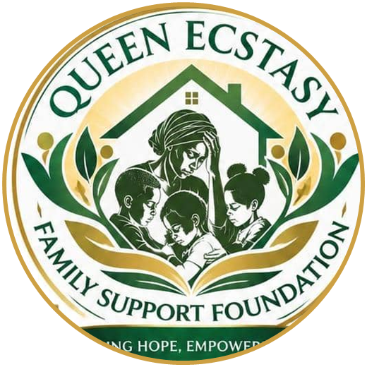

#  Queen Ecstasy Family Support Foundation

<div align="center">

**Restoring Hope · Empowering Lives**

[](https://samoskillxteam.github.io/qefsfoundation)
[](https://wa.me/2347081954398)
[](LICENSE)
[](https://developer.mozilla.org/en-US/docs/Web/HTML)
[](https://developer.mozilla.org/en-US/docs/Web/CSS)
[](https://developer.mozilla.org/en-US/docs/Web/JavaScript)

</div>

---

## About the Foundation

**Queen Ecstasy Family Support Foundation (QEFSF)** is a registered non-governmental organization headquartered at **No. 294 Obioma Abara Street, Arab Road, Kubwa, Abuja, Nigeria**.

Founded by **Queen Esther Chukwumaeze**, herself a young widow who overcame grief and adversity through faith and community, the Foundation is dedicated to:

- Empowering young widows — restoring their dignity, self-reliance, and economic independence
- Child education scholarships — ensuring vulnerable children have access to quality education
- Emergency food relief — feeding families through mass food distribution outreaches in Abuja
- Medical and health outreach — providing free health screenings and medical support
- Legal rights advocacy — protecting widows from forced disinheritance, eviction, and cultural harassment
- Women vocational skills training — tailoring, fashion, and entrepreneurship programs

> *"No young widow should ever walk through darkness alone or believe their story is over."*
> — Queen Esther Chukwumaeze, Founder & President

---

## Website Overview

This is the official static website for Queen Ecstasy Family Support Foundation, built to:

- Showcase the Foundation's humanitarian programs and community impact
- Enable individuals, companies, and diaspora donors to support and donate
- Allow volunteers, beneficiaries, and partners to reach out directly
- Provide transparent information about the Foundation's mission, vision, and work

### Pages

| Page | Description |
|------|-------------|
| `index.html` | Homepage — Hero, Programs overview, Donation section, Impact stats, Testimonials |
| `about.html` | About the Foundation — Founder's story, Mission & Vision |
| `services.html` | Programs & Outreaches — All 6 humanitarian programs in detail |
| `contact.html` | Contact page — Form, WhatsApp, bank donation details, office map |

---

## Features

- **Fully Static** — Pure HTML, CSS, and JavaScript. No backend required.
- **Fully Responsive** — Optimized for mobile, tablet, and desktop
- **Premium Dark-Green & Gold Design** — Branded color palette matching the Foundation's identity
- **WhatsApp Integration** — Floating WhatsApp button on all pages for instant contact and donation confirmation (0708 195 4398)
- **Donation Section** — Bank transfer details with WhatsApp donation confirmation flow
- **Google Maps Embed** — Office location in Kubwa, Abuja
- **Nigerian-themed Imagery** — All photos and illustrations are Nigerian/African in representation
- **Active Navigation States** — Each page highlights its active menu item
- **Branded Preloader** — Foundation logo as the page loading animation
- **Smooth Text Animations** — WOW.js and GSAP-powered scroll animations

---

## Tech Stack

| Technology | Usage |
|------------|-------|
| **HTML5** | Page structure and semantic markup |
| **CSS3 / Custom CSS** | Styling, animations, responsive layout |
| **Bootstrap 5** | Grid system and responsive utilities |
| **JavaScript (Vanilla)** | Interactive elements |
| **jQuery** | DOM manipulation and plugin support |
| **GSAP** | Advanced text and scroll animations |
| **Swiper.js** | Testimonial and content sliders |
| **WOW.js** | Scroll-triggered reveal animations |
| **Font Awesome 6** | Icon library |
| **Google Fonts** | Modern typography |

---

## Project Structure

```
qefsfoundation/
├── index.html              # Homepage
├── about.html              # About page
├── services.html           # Programs & Outreaches page
├── contact.html            # Contact & Donate page
├── css/
│   └── custom.css          # All custom styles and theme variables
├── js/
│   ├── function.js         # Core custom JS logic
│   ├── bootstrap.min.js
│   ├── jquery-3.7.1.min.js
│   ├── gsap.min.js
│   └── ...
├── images/
│   ├── logo-badge.png      # Circular foundation logo badge
│   ├── founder-queen-esther.jpg
│   ├── hero-nigerian-family.jpg
│   ├── about_header_bg.jpg
│   ├── services_header_bg.jpg
│   ├── contact_header_bg.jpg
│   ├── food-relief-distribution.jpg
│   ├── women-skills-training.jpg
│   ├── child-education-scholarship.jpg
│   ├── medical-health-outreach.jpg
│   └── ...
└── docs/
    └── logo.jpeg           # Original high-res logo
```

---

## Getting Started

This is a pure static HTML site — no build step required.

1. **Clone the repository**
   ```bash
   git clone https://github.com/samoskillxteam/qefsfoundation.git
   cd qefsfoundation
   ```

2. **Open with a local server** (e.g., XAMPP, VS Code Live Server, or Python):
   ```bash
   python -m http.server 8080
   ```
   Then open `http://localhost:8080` in your browser.

3. Or simply **open `index.html`** directly in any browser.

---

## Contact & Donations

| Channel | Details |
|---------|---------|
| **Address** | No. 294 Obioma Abara Street, Arab Road, Kubwa, Abuja, Nigeria |
| **Phone / WhatsApp** | [0708 195 4398](https://wa.me/2347081954398) |
| **Email** | info@queenecstasyfoundation.org |
| **Bank (NGN)** | Queen Ecstasy Family Support Foundation — Zenith Bank / First Bank |
| **Office Hours** | Monday – Saturday: 9:00 AM – 5:00 PM |

After making a bank transfer, confirm your donation by messaging on WhatsApp:
[wa.me/2347081954398](https://wa.me/2347081954398?text=Hello%20Queen%20Ecstasy%20Foundation%2C%20I%20have%20sent%20a%20donation%20and%20would%20like%20to%20confirm%20my%20support.)

---

## Contributing

Pull requests are welcome for bug fixes, accessibility enhancements, and performance optimizations. Please open an issue first to discuss proposed changes.

---

## License

This project is open source under the [MIT License](LICENSE).
Copyright 2026 Queen Ecstasy Family Support Foundation. All Rights Reserved.

---

<div align="center">

**People · Families · Stronger Communities**

*Built with love to restore hope and empower lives in Abuja, Nigeria.*

</div>
